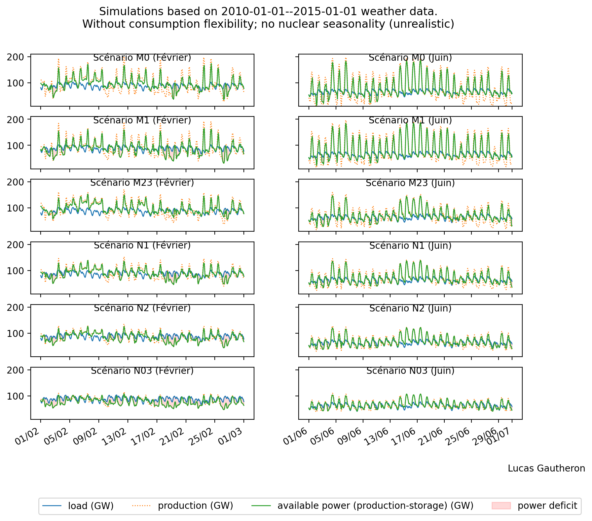
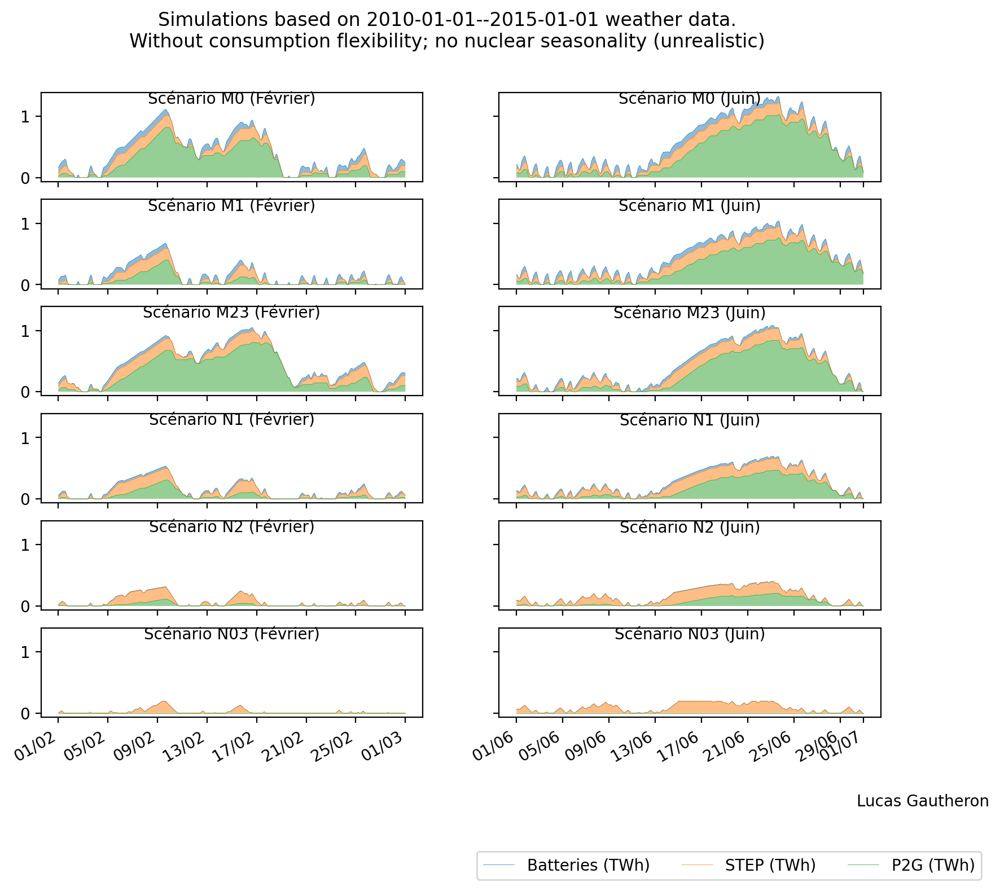

# Simulations mix énergétiques

- [Méthodologie](#méthodologie)
- [Installation](#installation)
  - [Installation de DataLad](#installation-de-datalad)
  - [Installation du répertoire et des données](#installation-du-répertoire-et-des-données)
  - [Installation des dépendances](#installation-des-dépendances)
- [Usage du code](#usage-du-code)
  - [Exécution](#exécution)
- [Output](#output)
- [Limitations](#limitations)
- [TODO](#todo)

Ce code implémente une simulation simpliste de mix énergétiques, avec une modélisation (grossière) des sources intermittentes, du nucléaire, des sources pilotables, des moyens de stockage, et de la flexibilité de la demande.

Ce code est l'étape 0 d'un projet qui vise à comprendre les vulnérabilités des différents scénarios de mix énergétiques envisagés pour la France. La modélisation proposée est très simpliste et sous-optimale de plusieurs points de vue.

## Méthodologie

Les facteurs de charge des sources intermittentes sont tirés des valeurs de [renewables.ninja](https://github.com/renewables-ninja) pour les années 1985 à 2015.

Les sources pilotables sont modélisées via deux paramètres par type de source : puissance maximale et production annuelle maximale.

Le stockage est modélisé par la charge (maximale permise) de chaque type de stockage (selon un ordre de priorité) en cas de surplus de production et leur décharge (maximale permise) en cas de déficit de production (selon le même ordre de priorité).

La flexibilité de la demande est modélisée par un report de demande optimal pour diminuer le déficit de production. Le modèle possède pour l'instant deux paramètres : la puissance maximale reportable et le temps sur lequel elle peut-être reportée (par défaut, 8 heures).

La consommation est modélisée par un fit des composantes de fourier capturant les variations saisonnières, hebdomadaires et diurnes ajusté aux données de consommation 2012--2021 et normalisées pour obtenir la demande annuelle totale des différents scénarios. D'autres modèles seront proposés, par exemple une modélisation basée sur les températures.

Pour l'instant, le nucléaire est modélisé comme une source non pilotable de facteur de charge constant égal à 0,7.
Le modèle sera ajusté pour tenir compte des variations saisonnières de disponibilité du nucléaire, optimisées au regard des variations saisonnières de demande.

## Installation

### Installation de DataLad

Pour récupérer les données, DataLad est nécessaire. Il s'agit d'une extension de git capable de gérer de gros fichiers.

Sous Linux :

```bash
apt install datalad
```

Sous MacOS :

```bash
brew install datalad
```

Consulter les instructions pour Windows ou concernant tout éventuel problème impliquant l'installation de DataLad sur n'importe quel système, reportez-vous aux [instructions officielles](https://handbook.datalad.org/en/latest/intro/installation.html#install-datalad).

### Installation du répertoire et des données

```
datalad install git@github.com:lucasgautheron/scenarios-rte-simulation.git
cd scenarios-rte-simulation
datalad get .
```

### Installation des dépendances

Pour installer les dépendances, l'instruction suivante devrait fonctionner (depuis le répertoire) :
 
```bash
pip install -r requirements.txt
```

## Usage du code

### Exécution

Pour exécuter le code, il suffit d'exécuter le script `run.py'.

```bash
$ python run.py --help
usage: run.py [-h] --begin BEGIN --end END [--flexibility] [--scenarios SCENARIOS]

optional arguments:
  -h, --help            show this help message and exit
  --begin BEGIN         begin date (YYYY-MM-DD), between 1985-01-01 and 2015-01-01
  --end END             end date (YYYY-MM-DD), between 1985-01-01 and 2015-01-01
  --flexibility         enable load flexibility modeling
  --scenarios SCENARIOS
                        path to scenarios parameters yml file
```

Par exemple, pour les scénarios RTE sans flexibilité à partir des facteurs de charge éolien/PV de 2012--2015:

```bash
python run.py --begin 2012-01-01 --end 2015-01-01
```

## Output






## Limitations

Outre les limitations mentionnées plus haut, il faut en souligner d'autres ici :

 - Chaque optimisation du modèle est effectuée séquentiellement. Mais de meilleurs optimums pourraient être trouvés en optimisant simultanément toutes les commandes (stockage, flexibilités et sources pilotables). En particulier la performance du modèle actuel dépend de l'ordre des optimisations.
 - La question cruciale est bien sûr : que cherche-t-on à optimiser (e.g., minimiser) ? Dans le cas présent la fonction de coût est égale à l'énergie manquante totale pour absorber la demande française avec la production française. Cela est pertinent dans le sens suivant : ce manque doit être compensé par, soit, des énergies fossiles raréfiées émettrices de CO2 ; soit des importations ; soit de l'effacement. On cherche à minimiser simultanément ces conséquences indésirables, et donc l'énergie totale manquante est un paramètre relativement sensé. Cependant, une telle stratégie :
   - ne tient pas compte du fait que l'on peut aussi vouloir minimiser la fréquence des situations dans lesquelles ni l'importation ni d'éventuelles capacités fossiles additionnelles ne peuvent couvrir la demande, ce qui peut conduire à des blackout extrêmement couteux. Autrement dit, au lieu de minimiser le déficit total (ou de façon équivalente, le déficit /moyen/), on peut chercher à vouloir minimiser les événements extrêmes dont les conséquences négatives sont particulièrement élevées.
   - ici l'optimisation est faite au niveau national, ce qui minimise le recours aux interconnexions avec l'Europe. On pourrait aussi chercher à considérer des optimums européens, lesquels seront d'autant meilleurs que l'usage des interconnexions (et donc leur capacité a fortiori) est important. À cela j'opposerais que l'on peut vouloir étudier un scénario pessimiste concernant les facultés de coopération futures entre pays européens. Oui, les équilibres seraient meilleurs avec plus de coopération, mais le niveua de celle-ci n'est pas garanti. C'est ce que souligne RTE dans son rapport sur les futurs énergétiques.

## TODO

  - Optimisation de disponibilité du nucléaire (actuellement un facteur de charge constant est assumé, ce qui pénalise les modèles avec nucléaire)
  - Meilleure modélisation des flexibilités
  - Documentation des sources de données
  - Documentation du code
  