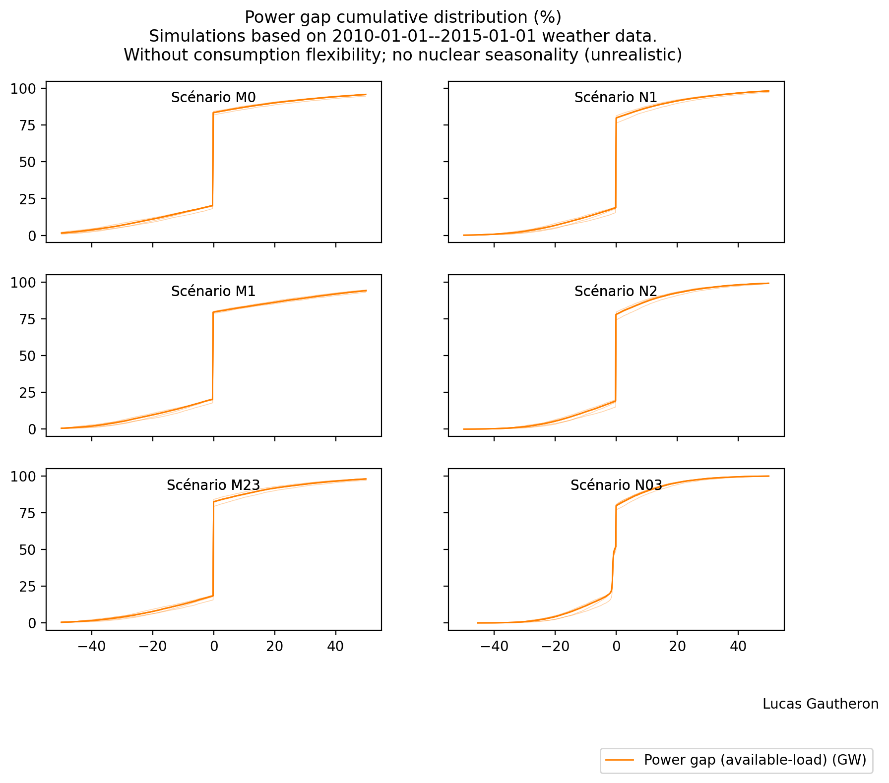

# Simulations mix énergétiques

Ce code implémente une simulation simpliste de mix énergétique. 

## Installation

### Installation du répertoire et des données

#### Installation de DataLad

Pour récupérer les données, DataLad est nécessaire. Il s'agit d'une extension de git capable de gérer de gros fichiers.

Sous Linux :

```bash
apt install datalad
```

Sous MacOS :

```bash
brew install datalad
```

Consulter les instructions pour Windows ou concernant tout éventuel problème impliquant l'installation de DataLad sur n'importe quel système, reportez-vous aux [instructions officielles](https://handbook.datalad.org/en/latest/intro/installation.html#install-datalad).

#### Installation du répertoire et des données

```
datalad install git@github.com:lucasgautheron/scenarios-rte-simulation.git
cd scenarios-rte-simulation
datalad get .
```

### Usage du code

#### Installation des dépendances

Pour installer les dépendances, l'instruction suivante devrait fonctionner (depuis le répertoire) :
 
```bash
pip install -r requirements.txt
```

#### Exécution

Pour exécuter le code, il suffit d'exécuter le script `run.py'.

```bash
$ python run.py --help
usage: run.py [-h] --begin BEGIN --end END [--flexibility] [--scenarios SCENARIOS]

optional arguments:
  -h, --help            show this help message and exit
  --begin BEGIN         begin date (YYYY-MM-DD), between 1985-01-01 and 2015-01-01
  --end END             end date (YYYY-MM-DD), between 1985-01-01 and 2015-01-01
  --flexibility         enable load flexibility modeling
  --scenarios SCENARIOS
                        path to scenarios parameters yml file
```

Par exemple, pour les scénarios RTE sans flexibilité à partir des facteurs de charge éolien/PV de 2012--2015:

```bash
python run.py --begin 2012-01-01 --end 2015-01-01
```

## Output




## TODO

  - Optimisation de disponibilité du nucléaire (actuellement un facteur de charge constant est assumé, ce qui pénalise les modèles avec nucléaire)
  - Meilleure modélisation des flexibilités
  - Documentation des sources de données
  - Documentation du code